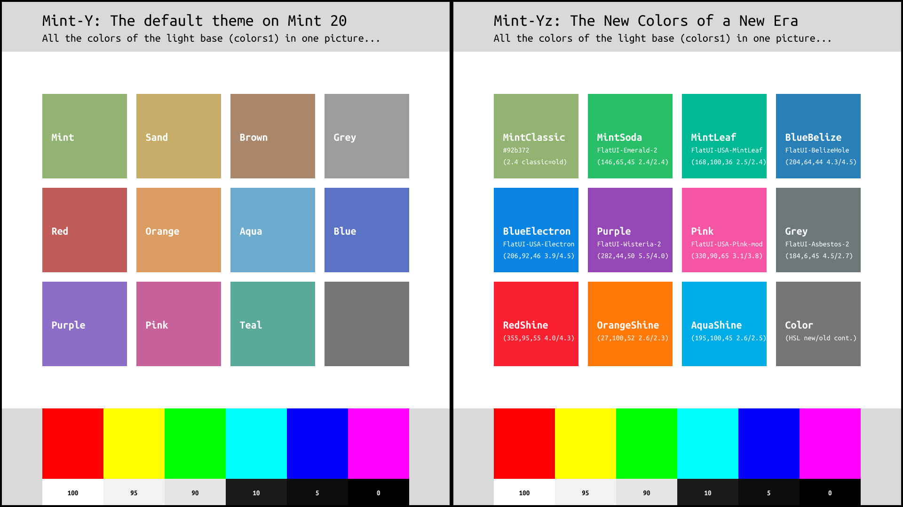

### A new approach to please everyone
There are 16.7 million color possibilities. We can't make them all. We want to offer 11 or 12 of them. With the dark and darker variants, that makes 33 or 36.

This new approach here is to offer a smaller range of colors, focusing on the most popular, but with much more variations. Something for each one of us. So, there are some heavily subdued colors for the nostalgic people. And there are also some vibrant colors to bring some happiness into those rainy days. But most of this new Mint-Yz color palette is made of well-balanced colors for a flat, modern user interface.

This translates into having some dull colors taken from the old Mint-Y. Those old ones are renamed with the "Classic" suffix, so, you know what you get. On the opposite, there are a few others that are coming from the previous versions of this Mint-Yz. These are renamed with the "Shine" suffix so, they are also clearly identified. And then there are all the others, and that is the majority of this new Mint-Yz. All these colors that are not part of the "Classic" or "Shine" groups are coming from https://flatuicolors.com/. These are well balanced colors and they should suit most people.

### The main colors 1, plus colors 2, 3 and 4
* **Mint-Y-Variations SVG and PNG files:** This is where all the colors are displayed. View them all there, grouped into one picture, one vision. You can edit the source in Mint-Y-Variations-src.svg. All the other SVG files are linked to this source.
* **constants.py file:** All the #HEX values from Mint-Y-Variations.svg are there. This new file should replace the old https://github.com/linuxmint/mint-themes/blob/master/constants.py. (Don't forget to keep Mint-X !)

All those colors are displayed in **Mint-Y-Colors/Mint-Y-Variations.svg** and then they are all pasted one-by-one in **constants.py** using a color picker.

Take a look at this `constants.py` file:

1. `colors1` is the base color
1. `colors2` is for the dark variants
1. `colors3` and `colors4` are just for those tiny `titlebutton-close-hover` and `titlebutton-close-active`, respectively.

* I recommend setting `colors2` 5% darker, unless this color is already dark.
* `colors3` should be 20% lighter. (Based on the old Mint-Y colors analysis)
* `colors4` should be 30% darker. (Based on the old Mint-Y colors analysis)

OPTIONAL: I made a simple trick to quickly get those values and copy them into the `constants.py` file. Open the `Mint-Y-Colors/Mint-Y-Variations-NEW.svg` file into Inkscape. Check the different layers. There are layers named `colors2`, `colors3` and `colors4`. By making them visible only one layer at a time, i used a color picker to quickly "pick and paste" all the 11 colors for all those colors 1, 2, 3 and 4. But feel free to get those values any way you want.

### message-colors.svg and _colors.scss files
Copy-Paste those lines from the message-colors.svg file:

    $link_color: #(LATESTCOLOR);
    $link_visited_color: #(LATESTCOLOR);
    //___
    $selection_mode_bg: $selected_bg_color;
    $selection_mode_fg: $selected_fg_color;
    $warning_color: #(LATESTCOLOR);
    $warning_fg_color: white;
    $error_color: #(LATESTCOLOR);
    $error_fg_color: white;
    $success_color: #(LATESTCOLOR);
    $destructive_color: #(LATESTCOLOR);
    $suggested_color: #(LATESTCOLOR);
    $question_color: #(LATESTCOLOR);
    //___
    $drop_target_color: #(LATESTCOLOR);

These lines replaces the corresponding ones in:

    ~/mint-themes/src/Mint-Y/gtk-3.0/sass/_colors.scss