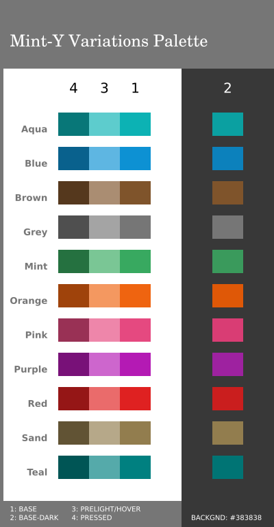

*early-pre-beta-release (Not complete yet!)*
# Mint-Y new colors
### Pure. Vitaminized. And readable.

I started working on this fork on 2020-02-11. It is a work-in-progress. I will collaborate on **linuxmint/mint-themes,** so this fork here is just my own personal experiments...

All the new Mint-Y colors are here except the Mint green. We will talk about Mint green later.

Ready to install and test:

`cp -R usr/share/themes/* ~/.themes/`
(this is early-pre-beta-release!)

**Known issues:**

  * Mint green is still the old one.
  * New thumbnails are not done yet, so at first sight, in cinnamon-settings themes, nothing looks new! But just click and see...
  * usr/share/themes/Mint-Y-(colors)/gtk-2.0/menubar-toolbar/(asset).png are apparently generated, but they remain in /assets/. So these are still the old green ones. (I am not using colorize.py; this needs further investigation...)

